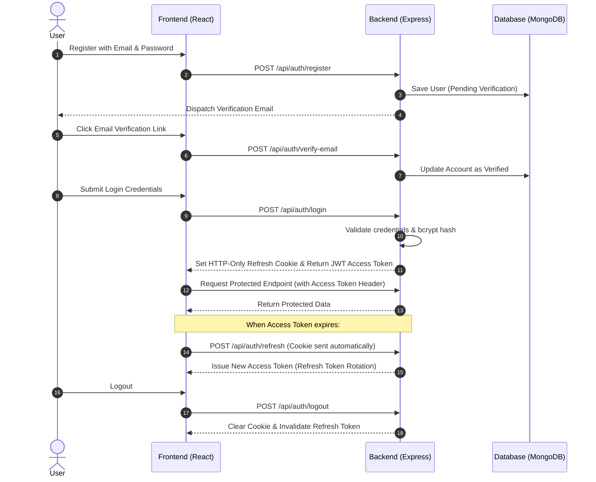

<div align="center">

# 🔐 Authify

### *A Production-Inspired Full-Stack Authentication & Authorization Engine*

[](https://authify-authentication-system.vercel.app)
[](https://authify-authentication-system.onrender.com)
[](https://opensource.org/licenses/MIT)

<br/>

[](https://react.dev/)
[](https://nodejs.org/)
[](https://expressjs.com/)
[](https://www.mongodb.com/)
[](https://tailwindcss.com/)
[](https://jwt.io/)
[](https://oauth.net/2/)

<br/>

<p align="center">
  A production-inspired full-stack authentication system built with the <b>MERN stack</b>. Authify provides secure authentication, OAuth integration, email workflows, JWT-based authorization, refresh token rotation, profile management, and role-based access control in a reusable architecture.
</p>

> **Core Philosophy:** Designed as a reusable authentication backend that can be integrated into future applications.

<br/>

[🚀 Live Demo](https://authify-authentication-system.vercel.app) • [🔌 Backend API](https://authify-authentication-system.onrender.com) • [💻 GitHub Profile](https://github.com/Manya22Kes) • [🌐 Developer Portfolio](https://manya-keserwani.netlify.app)

</div>

---

## 📑 Table of Contents

- [🌐 Live Deployment](#-live-deployment)
- [✨ Key Features](#-key-features)
- [🛡️ Core Security Features](#️-core-security-features)
- [🛠️ Tech Stack](#️-tech-stack)
- [🔄 Authentication Flow](#-authentication-flow)
- [📁 Project Structure](#-project-structure)
- [🚀 Getting Started](#-getting-started)
- [🎯 Future Improvements](#-future-improvements)
- [👤 Author & Connect](#-author--connect)
- [📄 License](#-license)

---

## 🌐 Live Deployment

| Service | Environment | Link |
| :--- | :--- | :--- |
| **Frontend Application** | Vercel | [authify-authentication-system.vercel.app](https://authify-authentication-system.vercel.app) |
| **Backend API Server** | Render | [authify-authentication-system.onrender.com](https://authify-authentication-system.onrender.com) |

---

## ✨ Key Features

### 🔑 Authentication
- **Email & Password Registration:** Safe signup pipeline with sanitized data.
- **Secure Login & Logout:** Stateless session management with controlled invalidation.
- **JWT Authentication:** Short-lived access tokens for secure API interactions.
- **Refresh Token Rotation:** Automatic rotation preventing reuse attacks and extending valid sessions securely.
- **Protected Routes:** Granular frontend and backend route guards.

### 🌐 OAuth Integrations
- **Google OAuth 2.0:** One-tap and OAuth credential flow via Google Identity Services.
- **GitHub OAuth:** Fast developer-friendly authentication via GitHub App integration.

### 📧 Email Workflows
- **Email Verification:** Account activation links upon signup.
- **Resend Verification Email:** Option to dispatch a new verification email when needed.
- **Forgot Password:** Secure reset requests generated with expiring tokens.
- **Password Reset:** Safe password reconfiguration workflows.
- **Welcome Emails:** Automated onboarding messaging upon successful verification.
- **Login Notification Emails:** Proactive security alerts triggered on sign-in events.

### 👤 User Management
- **Profile Management:** Full user detail updates and settings.
- **Avatar Uploads:** Cloudinary-backed multimedia storage and processing.
- **Verification Status:** Live badge tracking for user account confirmation.
- **Login History:** Audited session history and IP/device tracking.
- **Security Dashboard:** User-facing hub to inspect account protection settings.

### 🛡️ Authorization & System Security
- **Role-Based Access Control (RBAC):** Strict boundaries separating standard users and administrators.
- **Protected Admin Routes:** Exclusive endpoints and dashboards restricted to administrative roles.
- **Helmet Security Headers:** Protection against clickjacking, XSS, and sniff exploits.
- **HTTP-Only Cookies:** Shielding refresh tokens against client-side script inspection (XSS).
- **Password Hashing (bcrypt):** High work-factor cryptographic credential hashing.
- **Rate Limiting:** Protection against brute-force and denial-of-service spam.
- **Input Validation (Joi):** Strict schema-based request payload validation.
- **CORS Protection:** Configured cross-origin whitelisting for safe frontend-backend communications.

---

## 🛡️ Core Security Features

- 🔒 **JWT Authentication**
- 🔄 **Refresh Token Rotation**
- 🍪 **HTTP-only Secure Cookies**
- 🔑 **Password Hashing with bcrypt**
- ✉️ **Email Verification**
- 🔁 **Password Reset**
- 👋 **Welcome Emails**
- 🚨 **Login Notification Emails**
- 🌐 **Google OAuth**
- 🐙 **GitHub OAuth**
- 👥 **Role-Based Authorization**
- 📜 **Login History**
- 📊 **Security Dashboard**

---

## 🛠️ Tech Stack

### Frontend

| Technology | Badge / Ecosystem | Purpose |
| :--- | :--- | :--- |
| **React** |  | Core UI library |
| **React Router** |  | Client-side routing and protected route management |
| **Axios** |  | HTTP client with automated refresh interceptors |
| **Tailwind CSS** |  | Responsive, modern utility-first styling |
| **React Hot Toast** |  | Real-time notifications and UX feedback |
| **Google Identity Services** |  | Native Google OAuth client integration |

### Backend

| Technology | Badge / Ecosystem | Purpose |
| :--- | :--- | :--- |
| **Node.js** |  | Runtime environment |
| **Express.js** |  | RESTful API framework |
| **MongoDB** |  | NoSQL document database |
| **Mongoose** |  | Object Data Modeling (ODM) layer |
| **Passport.js** |  | Authentication middleware |
| **Passport-GitHub2**|  | GitHub OAuth 2.0 strategy |
| **Google Auth Library** |  | Token verification and Google authentication |
| **JWT** |  | Stateless session authorization |
| **Joi** |  | Schema validation for HTTP requests |
| **Bcrypt** |  | Salting and password hashing |
| **Resend** |  | Modern transactional email delivery service |
| **Cloudinary** |  | Cloud-based media and avatar storage |

---

## 🔄 Authentication Flow



### Flow Walkthrough
1. **Register with email/password.**
2. **Verify email.**
3. **Login to receive:**
   - JWT Access Token
   - HTTP-only Refresh Token Cookie
4. **Automatically refresh expired access tokens.**
5. **Access protected resources.**
6. **Logout and invalidate refresh token.**

> 💡 **OAuth Flow Note:** OAuth users can authenticate using Google or GitHub without requiring email verification.

---

## 📁 Project Structure

### Frontend Architecture

```text
frontend/
└── src/
    ├── api/
    │   ├── axios.js
    │   └── endpoints.js
    ├── components/
    │   ├── forms/
    │   ├── layout/
    │   ├── loaders/
    │   └── ui/
    ├── context/
    │   └── AuthContext.jsx
    ├── hooks/
    │   ├── useAuth.js
    │   └── useRefreshToken.js
    ├── layouts/
    │   ├── AuthLayout.jsx
    │   └── DashboardLayout.jsx
    ├── pages/
    │   ├── auth/
    │   │   ├── Login.jsx
    │   │   ├── Register.jsx
    │   │   ├── ForgotPassword.jsx
    │   │   ├── ResetPassword.jsx
    │   │   ├── VerifyEmail.jsx
    │   │   └── OAuthCallback.jsx
    │   ├── dashboard/
    │   │   ├── Dashboard.jsx
    │   │   ├── AdminDashboard.jsx
    │   │   ├── Profile.jsx
    │   │   ├── Sessions.jsx
    │   │   ├── Security.jsx
    │   │   ├── AuditLogs.jsx
    │   │   └── Support.jsx
    │   ├── Landing.jsx
    │   ├── Unauthorized.jsx
    │   └── NotFound.jsx
    ├── routes/
    │   ├── ProtectedRoute.jsx
    │   └── RoleRoute.jsx
    ├── services/
    │   ├── authService.js
    │   └── adminService.js
    ├── utils/
    │   ├── constants.js
    │   └── helpers.js
    ├── App.jsx
    ├── main.jsx
    └── index.css
```

### Backend Architecture

```text
backend/
├── package.json
└── server/
    ├── app.js
    ├── index.js
    ├── config/
    │   ├── db.js
    │   ├── env.js
    │   ├── cloudinary.js
    │   └── passport.js
    ├── controllers/
    │   ├── auth.controller.js
    │   ├── user.controller.js
    │   └── admin.controller.js
    ├── middlewares/
    │   ├── auth.middleware.js
    │   ├── upload.middleware.js
    │   ├── rateLimiter.js
    │   └── verified.middleware.js
    ├── models/
    │   └── user.model.js
    ├── routes/
    │   ├── auth.routes.js
    │   ├── user.routes.js
    │   └── admin.routes.js
    ├── services/
    │   ├── auth.service.js
    │   ├── user.service.js
    │   ├── token.service.js
    │   ├── email.service.js
    │   └── admin.service.js
    ├── utils/
    │   ├── uploadAvatar.js
    │   ├── hash.util.js
    │   └── token.js
    └── validators/
        ├── auth.validator.js
        └── user.validator.js
```

---

## 🚀 Getting Started

Follow these steps to run the application locally on your machine.

### 1. Clone the Repository

```bash
git clone https://github.com/YOUR_USERNAME/Authify.git
cd Authify
```

### 2. Backend Setup

```bash
# Navigate to backend directory
cd backend

# Install dependencies
npm install

# Start the server
npm start
```

### 3. Frontend Setup

```bash
# In a new terminal, navigate to frontend directory
cd frontend

# Install dependencies
npm install

# Run the development server
npm run dev
```

---

## 🎯 Future Improvements

- [ ] **Multi-Factor Authentication (MFA)**
- [ ] **Device Management**
- [ ] **Session Revocation**
- [ ] **Audit Logs**
- [ ] **Account Activity Timeline**
- [ ] **OAuth Account Linking**
- [ ] **WebAuthn / Passkeys**

---

## 👤 Author & Connect

**Manya Keserwani**

[](https://github.com/Manya22Kes)
[](https://manya-keserwani.netlify.app)

---

## 📄 License

This project is licensed under the **MIT License**.
